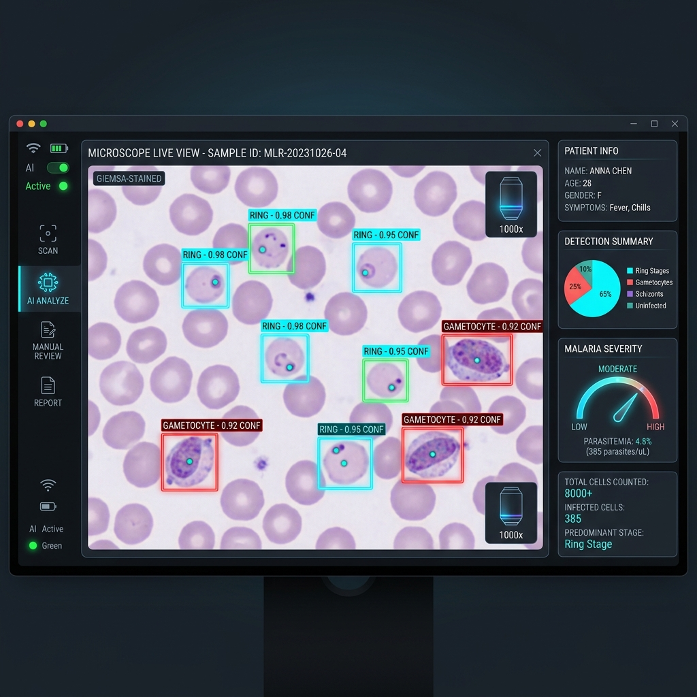
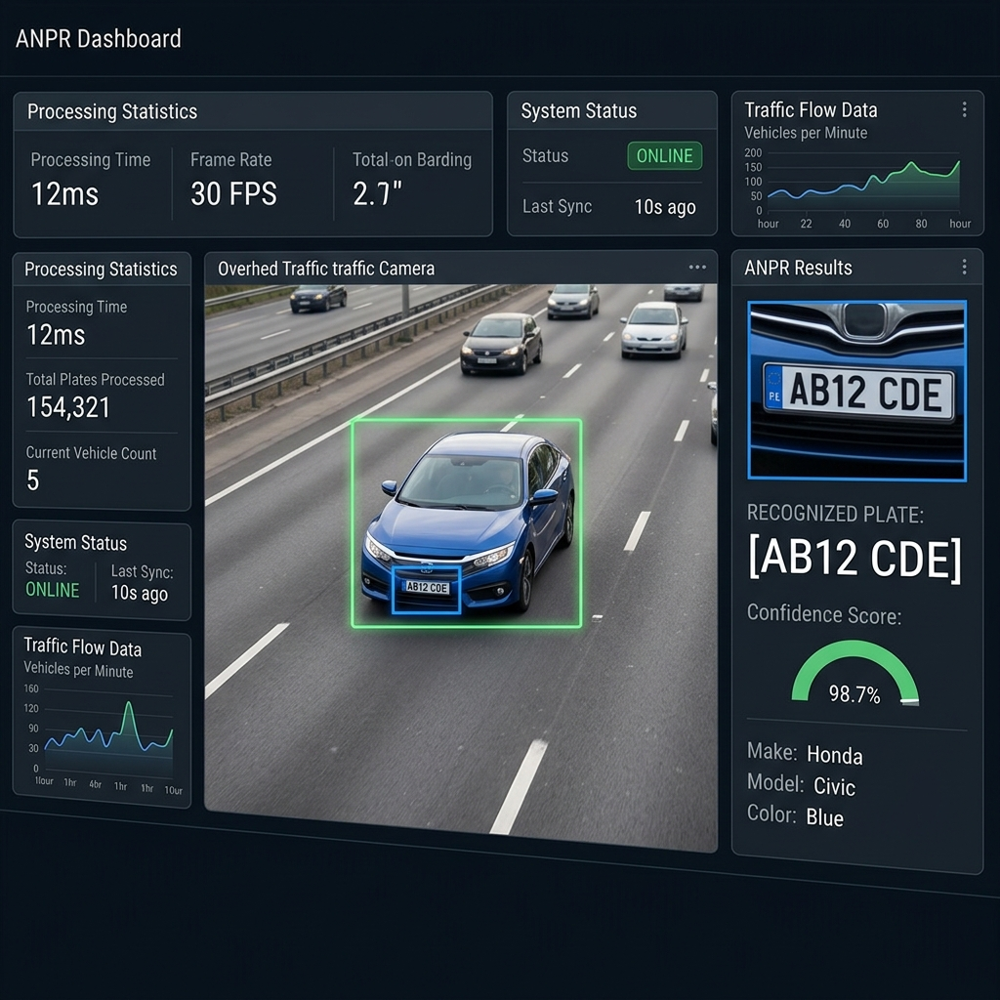

# 👨‍💻 Gabriel Akoleaje
### **AI Engineer • Computer Vision • Medical & Transportation AI • Backend Systems**

  
  
  
  

---

## 🎯 Vision & Mission
> **"Engineering practical computer vision systems for healthcare, mobility, and public infrastructure in Africa."**

Computer Science student at the University of Ibadan building AI systems for healthcare, transportation, and public infrastructure. My work centres on computer vision, backend engineering, and deploying practical, real-world focused AI into resource-constrained workflows.

---

## 🛠️ Tech Stack

**Languages**
* Python • C++ • TypeScript *(Learning)*

**Artificial Intelligence**
* OpenCV • PyTorch • Neural Networks • Deep Learning • Machine Learning • YOLO • Computer Vision • NumPy • Pandas

**Backend & Storage**
* FastAPI • REST APIs • SQLite

**Deployment & Tooling**
* Docker • Git • Streamlit • Hugging Face • Google Colab • Vercel • Netlify

---

## ⚡ Currently Building
* 🩸 **PlasmoID AI:** Clinical AI Assistant for Malaria Microscopy (optimizing CPU inference).
* 🚗 **CelesTium ANPR:** Automatic Number Plate Recognition System (modular vision pipeline).
* 🛰️ **Researching:** RF-DETR architectures, aerial computer vision, and low-resource medical segmentation.
* 🧠 **Learning:** PyTorch internals, custom neural network layers, and MLOps deployment pipelines.

---

## 🚀 Featured Projects

### 🔬 PlasmoID AI
*Clinical AI Assistant for Malaria Microscopy.*

#### Highlights
* **YOLOv8 parasite detection:** Real-time localization and counting of malaria parasites on blood smear images.
* **WHO severity classification:** Rules-based and deep learning classification mapping back to standard WHO clinical metrics.
* **Human-in-the-loop verification:** Pathologist dashboard to edit, review, and confirm findings before output.
* **Deployment-Ready:** CPU-optimized inference fine-tuned for legacy hardware in community health clinics.
* **Integrations:** Clinical PDF reports, batch processing, and CSV exports for epidemiology tracking.

---

### 🚗 CelesTium ANPR
*Automatic Number Plate Recognition System.*

#### Highlights
* **Vehicle & Plate Detection:** Modular dual-model computer vision pipeline optimized for accuracy.
* **Robust OCR Engine:** Built and tuned for challenging regional plate layouts and low-light environments.
* **FastAPI Backend:** High-performance async REST API processing camera feeds and webhook notifications.

---

### 📚 Bookiee AI
*AI-Powered Document Assistant.*

#### Highlights
* **Adaptive Summarization & Quiz Generation:** Automated parsing of textbook chapters into study guides.
* **Conversational AI Tutor:** RAG implementation grounding responses directly on local Document Vault uploads.

---

## 🗺️ Learning Journey

- [x] Python & OpenCV
- [x] FastAPI & REST APIs
- [x] Computer Vision Pipelines
- [x] Streamlit & Basic Prototyping
- [x] Docker Containerization
- [x] YOLO Architectures
- [ ] PyTorch Internals *(In Progress)*
- [ ] MLOps & Model Registries *(In Progress)*
- [ ] Edge AI & Custom Quantization
- [ ] Aerial & Satellite Vision
- [ ] Robotics

---

## 🔬 Research Interests
* **Medical AI:** Automated diagnostics, diagnostic assistant tools, and low-resource healthcare architectures.
* **Computer Vision:** Advanced object detection, spatial AI, and Vision Transformers (ViTs).
* **Edge AI:** Real-time inference on edge devices (Raspberry Pi/Jetson Nano) and model quantization.
* **Intelligent Transportation Systems:** Multi-sensor tracking, flow analysis, and smart infrastructure.
* **Satellite & Drone Vision:** Crop health classification and regional mapping via aerial imaging.
* **AI for Africa:** Applied ML tailoring research to local constraints, datasets, and hardware infrastructures.

---

## 📊 GitHub Analytics

  

  

---

## 📫 Let's Connect!
* **Email:** [gabbywrld066@gmail.com](mailto:gabbywrld066@gmail.com)
* **LinkedIn:** [/in/gabriel-akoleaje](https://linkedin.com/in/gabriel-akoleaje)
* **Twitter (X):** [@Celes_TiumAI](https://twitter.com/Celes_TiumAI)
* **Portfolio:** [celestiumai.vercel.app](https://celestiumai.vercel.app)
